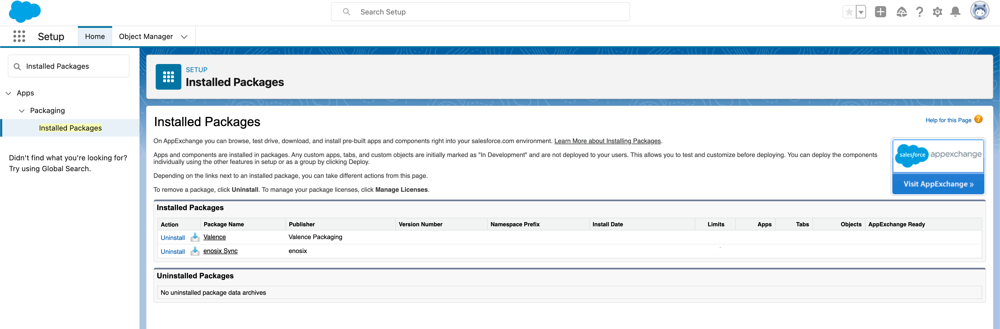
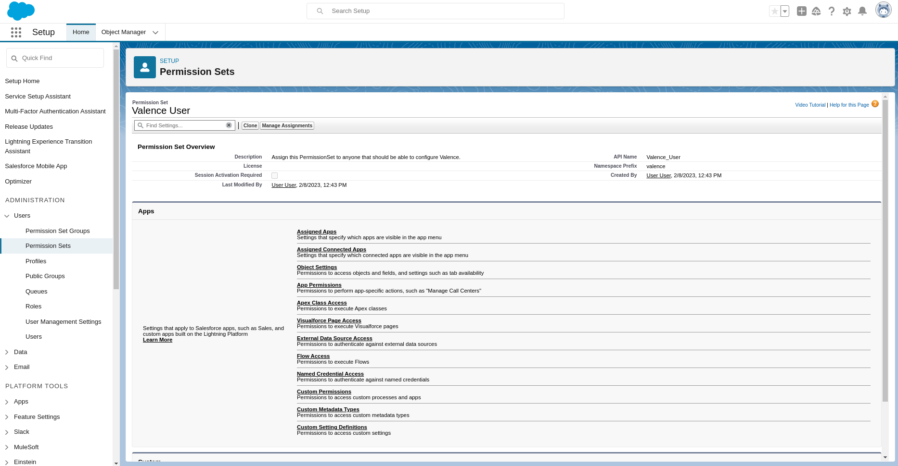

# Installing the enosix Sync for Salesforce example links

### Pre-req - Ensure enosix Sync for Salesforce is installed and configured
- Your Salesforce org will need to have the [latest release of enosix Sync for Salesforce installed](https://releases.enosix.io/release/tags/sync).
  
- Your user has been granted the `Valence_User` permission set

### Step 1 - Install the sample syncs

Click this button to install the `enosix Customer Sync`, `enosix Material Sync`, and `enosix Sync Example SAP` named credential into your org.  

### Step 2 - Update the `enosix Sync Example SAP` named credential
Update the `enosix Sync Example SAP` named credential to connect to the [enosix SAP Framework](https://docs.enosix.io/sap)

### Step 3 - Open the enosix Sync app
Open the enosix Sync for Salesforce app to run your syncs.

