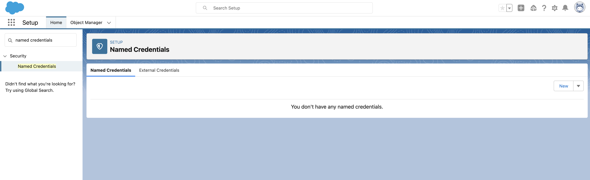
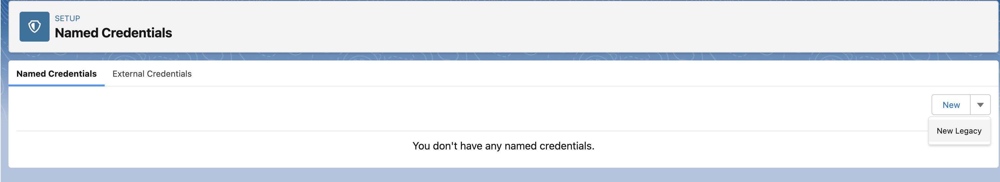
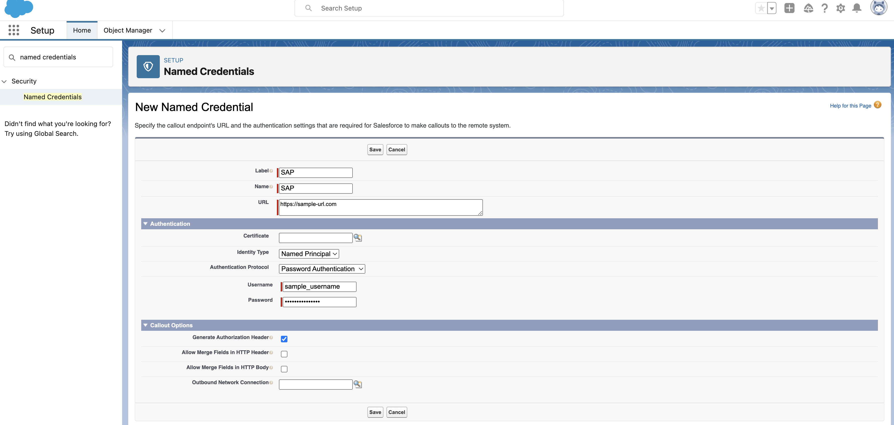
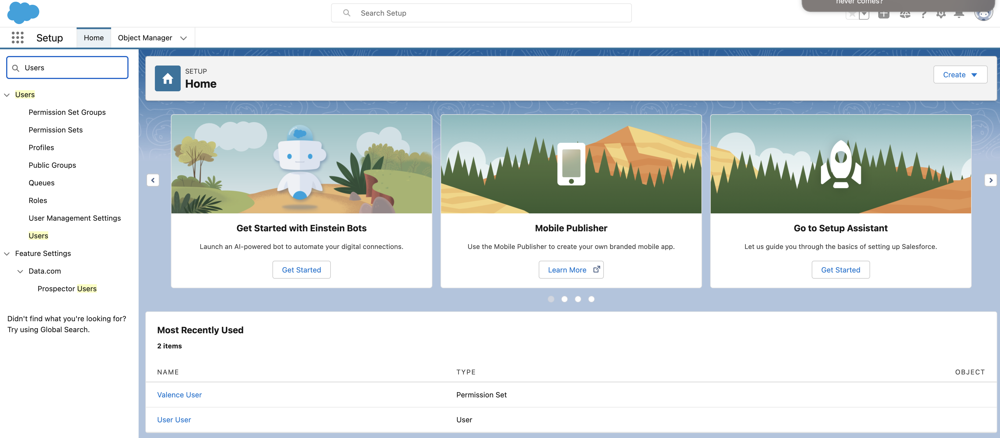
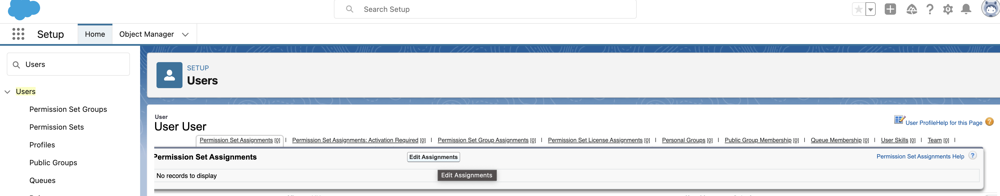
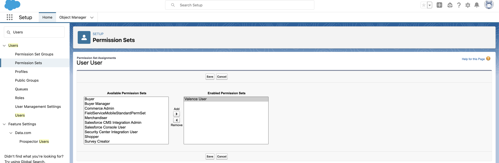

# Setup demo scratch org

## A new scratch org can be created automatically by running the following command

```
./rebuild-scratch.ps1
```

NOTE: Make sure you are in __sync-training__ directory


## To do it manually follow these steps
### Step 1 - Create a Scratch Org:

```
sfdx force:org:create --definitionfile ./../config/project-scratch-def.json --setdefaultusername --setalias sync-training --durationdays 30
```

### Step 2 - Install Valence & Sync App Packages:

```
sfdx force:package:install --package valence@2.0.1 --wait 30 --publishwait 30
sfdx force:package:install --package 04t8X000000MmPkQAK --wait 30 --publishwait 30
```

In order to verify that your packages are installed correctly, and to view their information, navigate to the Installed Packages page in Setup by typing 'Installed Packages' in the Quick Find box.


### Step 3 - Deploy Custom Metadata with Configured Links and Named Credential:

```
sfdx force:source:deploy --sourcepath "./src/unmanaged"
```

Adding a named credential can also be done manually.

1. In Setup, enter 'named credentials' in the Quick Find box.



2. Click on the down arrow next to the New button. Select 'New Legacy'.



3. Enter Label, Name, and the callout endpoint's URL. Select 'Named Principal' for identity type and 'Password Authentication' for the Authentication Protocol. Enter the username and password.



4. Configure the Callout Options according to your needs.

5. Click Save.


### Step 4 - Grant Permission to User:

Permission sets can be added to a user's profile either by command line or manually using the Salesforce Org UI.

#### Granting permission via command line

```
sfdx force:user:permset:assign --permsetname Valence_User
```

#### Granting permission manually

1. From Setup, enter Users in the Quick Find box, then select Users.



2. Select a user.


3. In the Permission Set Assignments related list, click Edit Assignments.



4. To assign a permission set, select it under Available Permission Sets and click Add. To remove a permission set assignment, select it  under Enabled Permission Sets and click Remove.



5. Click Save.

<br>

## Installing

Click this button to install the Filter into your org.

<a href="https://githubsfdeploy.herokuapp.com?owner=valence-filters&repo=constants&ref=main">
  
</a>